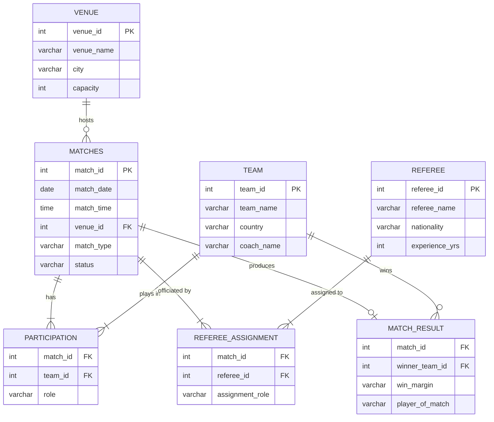

# ER Diagram — Cricket Tournament Scheduling DB

## Relationship Notes

- **VENUE → MATCHES**: One venue can host many matches, but each match has exactly one venue.
- **MATCHES ↔ TEAM** (via PARTICIPATION): Many-to-many. Each match has exactly 2 teams (enforced at application level). The `role` attribute distinguishes Home vs Away.
- **MATCHES ↔ REFEREE** (via REFEREE_ASSIGNMENT): Many-to-many. Each match has up to 4 officials (Umpire1, Umpire2, Third Umpire, Match Referee). The `UNIQUE(match_id, assignment_role)` constraint prevents duplicate roles.
- **MATCHES → MATCH_RESULT**: One-to-one optional. A result only exists after the match is completed.
- **MATCH_RESULT → TEAM** (winner): Optional FK. NULL when match is abandoned or drawn.
